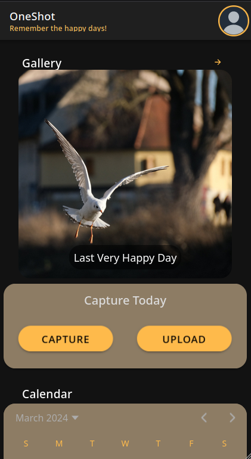
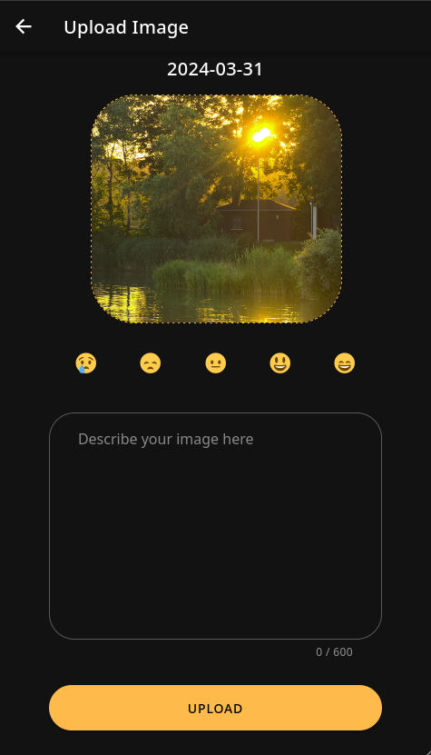

# oneshot-web

> [!NOTE]
> oneshot-web comes with absolutely no warranty and is currently in beta phase! It may still have some bugs. Please have a look at the [OneShot Android App](https://github.com/ptrLx/OneShot) for a tested and working offline version of OneShot.

OneShot is made to remind you of the special moments. Because every day has at least one. And that's what counts in life! So make it your habit and **remember the happy days!**

## Features

oneshot-web is a self-hostable version that follows the OneShot philosophy.

You can capture one entry per day, write your diary and store your happiness.  
It stores your photos in a folder on your server and your diary within a database on the server.

 

 

Thank's to [@Cynog](https://github.com/Cynog) for providing the beautiful images in the screenshots!

## Deployment of oneshot-web

Please check out the [deployment instructions](DEPLOY.md) if you want to self-host oneshot-web.

## Development Setup

1. clone the repository
2. open folder in vscode
3. install recommended extensions
4. create the required docker network: `docker network create --driver bridge os-web-db`
5. reopen in container
6. type `make` to see what you can do (e. g. how to build the docker image from source)

### Start the backend

1. `make start-api`

### Start the frontend

1. `make start-frontend`
